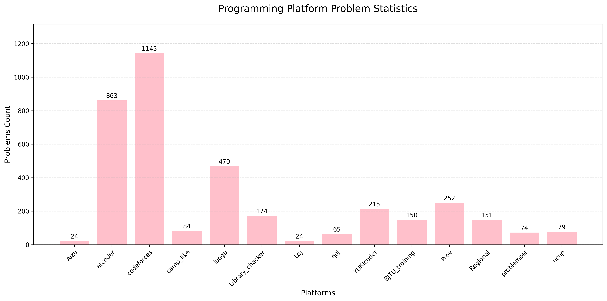

# Programming Problem Statistics

## Platform Statistics
#### Summary (since 2024/12)
- 2025/12/09   problems: 3199;
- 2025/11/25   problems: 3156;
- 2025/10/18   problems: 3106;
- 2025/09/26   problems: 3039;
- 2025/08/14   problems: 2711;
- 2025/07/26   problems: 2652;
- 2025/06/30   problems: 2400;
- 2025/05/27   problems: 2096;
- 2025/04/28   problems: 1842;
- 2025/03/31   problems: 1514;
- 2025/02/28   problems: 1096;
- 2025/01/30   problems: 833;
- 2024/12/31   problems: 485;
#### History (since 2025/03/12)
- 2025/12/09
  - loj_2625
  - P10689 P11620 P14513 P1527 P1912 P2178 P3232 P3292 P3515 P3810 P3980 P4197 P4254 P4839 P5503
- 2025/12/02
  - 98 cf beta78 -ak
  - 99 cf beta78 -ak
  - P13014 P1552 P2152 P2473 P2596 P3201 P3338 P3387 P3527 P3629 P3648 P3967 P4051 P4072 P4196 P4360 P4767 P5494 P6178 P6577
- 2025/11/25
  - P1048 P1537 P2444 P3327 P3391 P4036 P5906 P6329
  - Library_checker Vertex_Add_Range_Contour_Sum_on_Tree
  - 2025 南京
  - 2025 沈阳
  - 78 cf_beta70 -ak
  - 79 cf_beta71 -ak
  - 83 cf_beta72 -ak
  - 84 cf_beta72 -ak
  - 87 cf_beta73 -ak
  - 88 cf_beta73 -ak
  - 89 cf_beta74 -ak
  - 90 cf_beta74 -ak
  - 91 cf_beta75 -D
  - 92 cf_beta75 -ak
  - 93 cf_beta76 -ak
  - 94 cf_beta76 -ak
  - 95 cf_beta77 -ak
  - 96 cf_beta77 -ak
  - HNCPC2025
- 2025/11/10
  - 2020 沈阳
  - 2022 杭州
  - 2025 女生
  - 2025 成都
  - 2025 武汉
  - 2025 西安
  - ucup3-27
  - ucup3-28
  - P1501 P2147 P2173 P2387 P2542 P3203 P3206 P3478 P3690 P3793 P3976 P4115 P4145 P4219 P4230 P4234 P4271 P4319 P4332 P4546 P4751 P4782 P5024 P5043 P5354 P5489 P5622 P5649 P6097 P6292 P6664 P7735
  - Library_checker Dynamic_Tree_Subtree_Add_Subtree_Sum.cpp | Rooted_Tree_Isomorphism_Classification.cpp | Tree_Path_Composite_Sum.cpp
- 2025/10/18
  - ucup3-1
  - ucup3-10
  - ucup3-13
  - ucup3-15
  - ucup3-2
  - ucup3-21
  - ucup3-24
  - ucup3-3
  - ucup3-4
  - ucup3-7
  - ucup3-8
  - ucup4-2
  - Library_checker Rooted_Tree_Isomorphism_Classification | Tree_Path_Composite_Sum
  - 77 cf beta69 -ak
  - 2018 青岛
  - 2020 沈阳
  - 2021 沈阳
  - 2023 桂林
  - 2025 GCPC
  - P10639 P11615 P1175 P1972 P2312 P2408 P3292 P3372 P3521 P3538 P3567 P3804 P3925 P3950 P3975 P3976 P3979 P4070 P4151 P4211 P4216 P4248 P4315 P4320 P4323 P4606 P4616 P4630 P5043 P5273 P5305 P6157 P7735 P7911 P8289 P8496 P8815 P8969
- 2025/09/26
  - 2019 HNCPC -ak
  - 2025 SHCPC
  - 2019 SCCPC -F K
  - P_2521 P_2835 P_5214 P_6492 P_7251 P_8460
  - Library_checker Exp_of_Formal_Power_Series_Sparse | Inv_of_Formal_Power_Series_Sparse | Log_of_Formal_Power_Series_Sparse | Pow_of_Formal_Power_Series_Sparse | Sqrt_of_Formal_Power_Series_Sparse
  - 66 cf beta61 -ak
  - 68 cf beta62 -ak
  - 69 cf beta63 -ak
  - 70 cf beta64 -ak
  - 71 cf beta65 -ak
  - 73 cf beta66 -ak
  - 75 cf beta67 -ak
  - 76 cf beta68 -ak
  - 80 cf beta69 -ak
- 2025/09/16
  - JXCPC -J M
  - Library_checker Addition_of_Big_Integers | Division_of_Big_Integers | Minimum_Enclosing_Circle
  - Library_checker Minimum_Steiner_Tree | Multiplication_of_Big_Integers | Range_Add_Range_Min
  - ICPC online1
  - ICPC online2
  - P_3376
  - 2085 cf1011 -ak
  - 2086 edu177 -F
  - 2092 cf1014 -ak
  - 65 cf beta60 -E
- 2025/09/11
  - Library_checker 
    - Sort_Points_by_Argument | Determinant_of_Matrix | Determinant_of_Matrix_Arbitrary_Mod 
    - Inverse_Matrix | Matrix_Product | Pow_of_Matrix | Rank_of_Matrix | System_of_Linear_Equations 
    - Enumerate_Palindromes | Lyndon_Factorization | Palindromes_in_Deque | Prefix_Substring_LCS
    - Run_Enumerate | Wildcard_Pattern_Matching | Z_Algorithm | Eertree
  - P_4722 P_6114
- 2025/09/10
  - Library_checker Closest_Pair_of_Points | Furthest_Pair_of_Points | Manhattan_MST
  - HNCPC2018 -ak
  - AIZU geo -upd
  - P_1257 P_1429 P_1452 P_2742 P_4357 P_4423 P_4557 P_7883
  - cf beta53 -D
  - cf beta54 -E
  - cf beta55 -ak
  - cf beta56 -ak
  - cf beta57 -ak
  - cf beta58 -ak
  - cf beta59 -ak
- 2025/09/01
  - Library_checker 
    - 一般图最大匹配
  - luogu
    - 很多很多题
  - 多校
    - upd
  - thucamp
    - upd
- 2025/08/14
  - Library_checker 
    - Convolution_Large | Convolution_Mod_2_64 | Deque | Exp_of_Formal_Power_Series | Factorial | Factorize | 
    - Gcd_Convolution | Inv_of_Formal_Power_Series | Lcm_Convolution | Log_of_Formal_Power_Series | 
    - Pow_of_Formal_Power_Series | Sqrt_Mod | Sqrt_of_Formal_Power_Series
  - P_3649 P_4287 P_4762 P_5496 P_5555 P_5685
- 2025/08/12
  - 2127 cf1041 -G
  - 2129 cf1040 -C23 E F
  - Library_checker 
    - Assignment_Problem | Chromatic_Number | Cycle_Detection_Directed | Cycle_Detection_Undirected | 
    - Dominator_Tree | Enumerate_Cliques | Enumerate_Triangles | Eulerian_Trail_Directed | Eulerian_Trail_Undirected | 
    - Exp_of_Set_Power_Series | Longest_Increasing_Subsequence | Majority_Voting | Maximum_Independent_Set | 
    - Minimum_Cost_b_flow | Point_Add_Rectangle_Sum | Range_Chmin_Chmax_Add_Range_Sum | Range_Set_Range_Composite | 
    - Rectangle_Sum | Shortest_Path | Static_Range_Sum_with_Upper_Bound | Vertex_Add_Range_Contour_Sum_on_Tree | 
    - Vertex_Get_Range_Contour_Add_on_Tree
  - P_10461 P_10603 P_12230 P_12231 P_12232 P_2075 P_3806 P_4239 P_5264 P_5667 P_6097 P_6192 P_6329 P_6800
  - loj_184
- 2025/07/26
  - hdu 1
  - hdu 2
  - hdu 3
  - nowcode 1
  - nowcode 2
  - nowcode 3
  - nowcode 4
  - 2097 cf1021 -F
  - 2098 cf1021 -ak
  - 2106 cf1020 -G
  - 2122 cf1038 -?
  - 2125 edu181 -F
  - Library_checker Longest_Common_Substring | Number_of_Substrings | Suffix_Array | Two_Edge_Connected_Components
  - P_13310 P_3809 P_6656
  - abc414 -FG
  - abc415 -ak
  - loj_6235
  - qoj 2244 XXI 赛前模板训练赛
- 2025/07/11
  - 2101 cf1024 -EFG (div1)
  - 2009 cf1025 -F
  - 2102 cf1024 -ak
  - 2110 cf1026 -ak
  - Library_checker Static_Range_LIS_Query
- 2025/07/10
  - abc413 -ak
  - 2114 cf1027 -ak
  - 2116 cf1028 -EF
  - 2119 cf1025 -EF
  - 2142 cf1036 -F2GHI
  - 105668 MITIT 2025 begin -ak
- 2025/07/04
  - 2014 HNCPC -J
  - 2016 HNCPC -K
  - 2111 edu179 -G
  - 2117 cf1029 -ak
  - 2123 cf1034 -ak
  - 56 cf_beta52 -ak
- 2025/06/30
  - 2118 cf1030 -F
  - abc412 -G
  - P_3810
- 2025/06/28
  - 2120 cf1033 -G | div2
  - 2121 cf1032 -ak | div3
  - 2112 edu180 -ak
  - abc411 -ak
  - abc410 -ak
  - arc222 -CDE
  - arc223 -DF
  - 2025四川
  - 2025重庆
- 2025/06/20
  - 47 cf_beta44 -ak
  - 48 cf_beta45 -H
  - 49 cf_beta46 -ak
  - 50 cf_beta47 -ak
  - 51 cf_beta48 -ak
  - 53 cf_beta49 -ak
  - 54 cf_beta50 -ak
  - 55 cf_beta51 -ak
  - P_1989
- 2025/06/18
  - P_5179
  - Yukicoder No_1 No_2 No_3 No_4 No_5 No_6 No_7 No_8 No_9
  - 2113 cf1031 div2 -E
  - 38 cf_beta38 -H
  - 40 cf_beta39 -ak
  - 41 cf_beta40 -ak
  - 42 cf_beta41 -ak
  - 43 cf_beta42 -ak
  - 47 cf_beta43 -ak
- 2025/06/17
  - Aizu geometry 缺少小部分模板
  - nwerc2024 -B C G I 
  - abc408 -ak
- 2025/06/13
  - 2025山东省赛 -B
  - 2025南昌省赛 -B -J
  - 2025陕西 -4
  - 2022河南省赛 -C -D -L
- 2025/06/12
  - Library_checker Dynamic_Tree_Vertex_Add_Subtree_Sum | Counting_Primes | Discrete_Logarithm | Primality_Test | 
  - Dynamic_Tree_Vertex_Add_Path_Sum | Dynamic_Tree_Vertex_Set_Path_Composite
  - Library_checker Area_of_Union_of_Rectangles | Vertex_Set_Path_Composite | Vertex_Add_Path_Sum | Bitwise_Xor_Convolution | 
  - Library_checker Bitwise_And_Convolution | Jump_on_Tree | Subset_Convolution | Point_Set_Range_Sort_Range_Composite | 
  - Library_checker Tree_Diameter | Vertex_Add_Subtree_Sum | Convolution_Mod_1_000_000_007
- 2025/06/10
  - abc409 -ak
  - Library_checker Segment_Add_Get_Min | Queue_Operate_All_Composite | Set_Xor_Min | Rectangle_Sum | Static_Range_Frequency |
  - Library_checker Line_Add_Get_Min | Static_Range_Mode_Query | Static_Range_Count_Distinct | Static_Range_Inversions_Query |
  - Library_checker Multiplication_of_Big_Integers | Addition_of_Big_Integers | Range_Reverse_Range_Sum
- 2025/06/07
  - 2025 河北 -B -L
- 2025/06/06
  - P_5494 P_3368 P_5631 P_4556 P_3803 P_5050 P_3374 P_5245 P_5205 P_4512 P_5158 P_4245 P_4726 
  - P_4238 P_3224 P_10814 P_4718 P_4725
  - 2025 河南 -A -I
  - 05-21 BJTU训练赛 -I
- 2025/06/03
  - 2025 吉林省赛 -3
- 2025/05/26
  - 557 cf311 -ak
  - Library_checker Persistent_Range_Affine_Range_Sum | Point_Set_Range_Composite | Static_Range_Sum | 
  - Library_checker Static_RMQ | Point_Set_Range_Composite_Large_Array | Ordered_Set | 
  - Library_checker Range_Affine_Point_Get | Range_Affine_Range_Sum_Large_Array | Range_Affine_Range_Sum | 
  - Library_checker Point_Add_Range_Sum
  - P_2710 P_2042
  - loj_2097
  - 2020 四川省赛
  - abc406 -G
  - abc407 -ak
  - arc198 -E
- 2025/05/23
  - P_6136 P_4137 P_1486 P_8306 P_4234 P_2906 P_2410 P_3373 P_2824 P_3806 P_1648 
  - P_3730 P_2173 P_4915 P_3168 P_1712 P_2234 P_3369 P_3402 P_2147 P_9989 P_5193 
  - P_3293 P_2286 P_4198 P_4314 P_4219 P_2633
  - loj_2097
- 2025/05/16
  - P_5283 P_4887 P_4462 P_5501 P_2163 P_5047
- 2025/05/15
  - Library_checker A_B | K_Shortest_Walk | Many_A_B_128_bit | Many_A_B
  - Library_checker Associative_Array | Unionfind_with_Potential
  - Library_checker Unionfind | Double_Ended_Priority_Queue | Predecessor_Problem
  - P_2483 P_4555 P_4467 P_3649 P_5826 P_3500 P_7708
- 2025/05/13
  - 05-11 BJTU训练赛 -ak
  - 2021 四川省賽 -G
  - 546 cf304 -ak
  - P_12044
- 2025/05/10
  - abc218 -ak
  - abc405 -ak
  - 2107 cf1023 -ak
  - P_5787 P_5170 P_3384 P_2709 P_4306 P_5227 P_2900 P_3834 P_4513 P_5435 P_3919 P_2448
  - loj_138
- 2025/05/05
  - abc404 -ak
  - 05-03 BJTU训练赛 -ak
  - 05-04 BJTU训练赛 -ak
  - 05-05 BJTU训练赛 -ak
  - 525 cf297 -ak
  - 527 cf296 -ak
  - 665 edu12 -ak
- 2025/05/03
  - abc217 -ak
  - 04-30 BJTU训练赛 -ak
  - 05-02 BJTU训练赛 -ak
  - 2104 edu178 -F
  - 2108 cf1022 -ak
  - 514 cf291 -ak
  - 515 cf292 -ak
- 2025/04/27
  - abc403 -ak
- 2025/04/25
  - 32 cf_beta32 -ak
  - 33 cf_beta33 -E
  - 34 cf_beta34 -ak
  - 35 cf_beta35 -ak
  - 36 cf_beta36 -ak
  - 37 cf_beta37 -ak
- 2025/04/22
  - 04-23 BJTU训练赛 -ak
  - 30 cf_beta30 -ak
  - 31 cf_beta31 -ak
  - 505 cf286 -ak
  - 508 cf288 -ak
  - 1763 cf840 -ak
  - abc395 -ak
  - abc402 -G
- 2025/04/16
  - 04-16 BJTU训练赛 -ak
  - abc396 -ak
  - abc397 -ak
- 2025/04/15
  - 2094 cf1017(div 3) -ak
  - abc398 -ak
  - abc399 -G
  - abc400 -G
  - abc401 -ak
- 2025/04/13
  - 23 cf_beta23 -ak
  - 24 cf_beta24 -ak
  - 25 cf_beta25 -ak
  - 26 cf_beta26 -E
  - 27 cf_beta27 -ak
  - 28 cf_beta28 -E
  - 29 cf_beta29 -ak
- 2025/04/11
  - Loj_121
  - 18 cf_beta18 -ak
  - 19 cf_beta19 -ak
  - 20 cf_beta20 -ak
  - 21 cf_beta21 -ak
- 2025/04/09
  - P_4597
  - 12 cf_beta12 -ak
  - 13 cf_beta13 -ak
  - 14 cf_beta14 -ak
  - 15 cf_beta15 -ak
  - 16 cf_beta16 -ak
  - 17 cf_beta17 -ak
  - 2093 cf1016 -ak
- 2025/04/07
  - 10 cf_beta10 -ak
  - 11 cf_beta11 -E
  - P_2482 P_2764 P_4001 P_4195 P_4717 P_4721 P_5205 P_8819
- 2025/04/06
  - 9 cf_beta9 -ak
- 2025/04/05
  - 4 cf_beta4 -ak
  - 5 cf_beta5 -ak
  - 6 cf_beta6 -ak
  - 7 cf_beta7 -E
  - 8 cf_beta8 -ak
- 2025/04/04
  - 1 cf_beta1 -ak
  - 2 cf_beta2 -ak
  - 3 cf_beta3 -ak
  - 586 cf325 -ak
  - 899 cf452 -ak
- 2025/04/03
  - 22 cf22 -ak
  - 631 cf344 -ak
  - 1106 cf536 -F
  - 1282 cf610 -ak
- 2025/04/02
  - P_3372
  - 234 cf145 -ak
  - 712 cf370 -ak
  - 828 cf423 -F
- 2025/03/31
  - 03-31 BJTU第三届C语言积分赛 -ak
- 2025/03/28
  - 1398 edu93 -ak
  - 1665 cf781 -ak
  - P_1537 P_2375 P_3157 P_4213 P_8435 
  - Library_checker bcc
- 2025/03/27
  - 1380 edu91 -F
  - 1389 edu92 -G
- 2025/03/26
  - 2019 陕西省赛（组队） [-G]
- 2025/03/25
  - 2091 cf1013 div3 -ak
- 2025/03/24
  - P_4097 P_5785 P_9989 P_4983 
  - 李超树 [-2]
  - 凸优化 [-2]
- 2025/03/23
  - ZR 2024 B day1 斜率优化dp -ak
  - ZR 2024 B day1 状压dp [-4]
  - P_2657 P_2704 P_7519 P_7961 P_11714 P_4363 P_3195 P_3299 
- 2025/03/22 
  - 55 cf_beta51 -ak
  - Library_checker scc | BM
  - Loj_2384
  - P_3227 P_3386 P_3387 P_4003 P_6054
  - ZR 2024 A day1 上午(flow) [-7 -8 -13]
  - ZR 2024 B day1 数位dp [-5 -6 -7]
- 2025/03/21
  - 03-21 2025BJTU个人训练赛(7) Div III -ak
- 2025/03/20
  - 2075 edu176 -F
  - Loj_101 Loj_102 Loj_127 
  - P_1235 P_1561 P_2123 P_2144 P_2235 P_2293 P_2609 P_2613 P_3922 P_4204 P_4295
- 2025/03/19
  - 03-19 2025BJTU个人训练赛-LQ模式(6)-Div II -F
- 2025/03/17
  - P_2000 P_3367 P_4043 P_4708 P_4722 P_5468 P_9902 P_10509
  - 1373 edu90 -ak
- 2025/03/16
  - 03-16 2025BJTU个人训练赛(6) Div III -ak
  - 03-16 2025BJTU个人训练赛-ICPC模式(5) Div I -A -C
- 2025/03/15
  - 1366 edu89 -ak
  - 1359 edu88 -ak
  - 1354 edu87 -ak
- 2025/03/14
  - 03-14 2025BJTU个人训练赛(5) Div III -ak
  - 1342 edu86 -F
- 2025/03/13
  - 1334 edu85 -ak
  - 1327 edu84 -G
  - 105385 2024 山东邀请赛
- 2025/03/12
  - 1312 edu83 -F
  - 2074 cf1009 div(3) -ak
  - 1303 edu82 -G