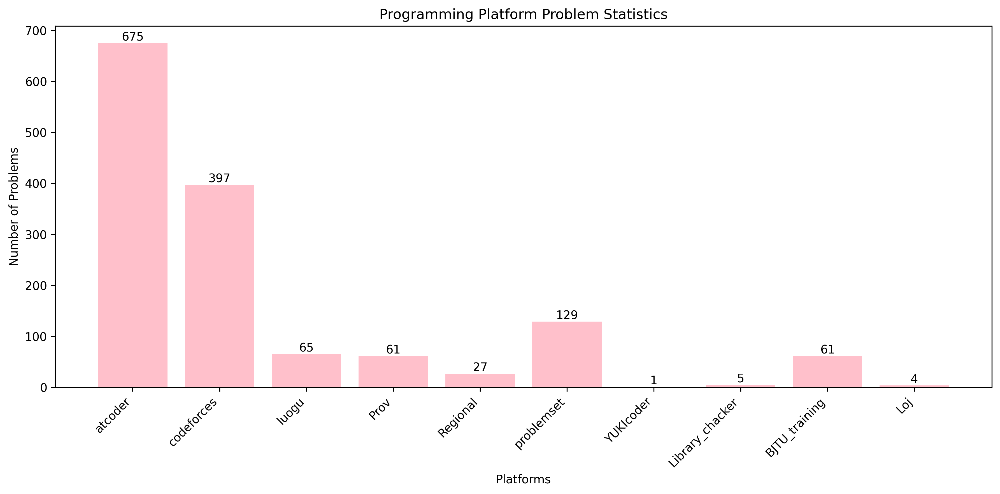

# Programming Problem Statistics

## Platform Statistics
#### Summary (since 2024/12)
- 2025/03/16   problems: 1357;
- 2025/02/28   problems: 1096;
- 2025/01/30   problems: 833;
- 2024/12/31   problems: 485;
#### History (since 2025/03/12)
- 2025/03/16
  - 03-16 2025BJTU个人训练赛-ICPC模式(5) Div I -A -C
- 2025/03/15
  - 1366 edu89 -ak
  - 1359 edu88 -ak
  - 1354 edu87 -ak
- 2025/03/14
  - 03-14 2025BJTU个人训练赛(5) Div III -ak
  - 1342 edu86 -F
- 2025/03/13
  - 1334 edu85 -ak
  - 1327 edu84 -G
  - 105385 2024 山东邀请赛
- 2025/03/12
  - 1312 edu83 -F
  - 2074 cf1009 div(3) -ak
  - 1303 edu82 -G