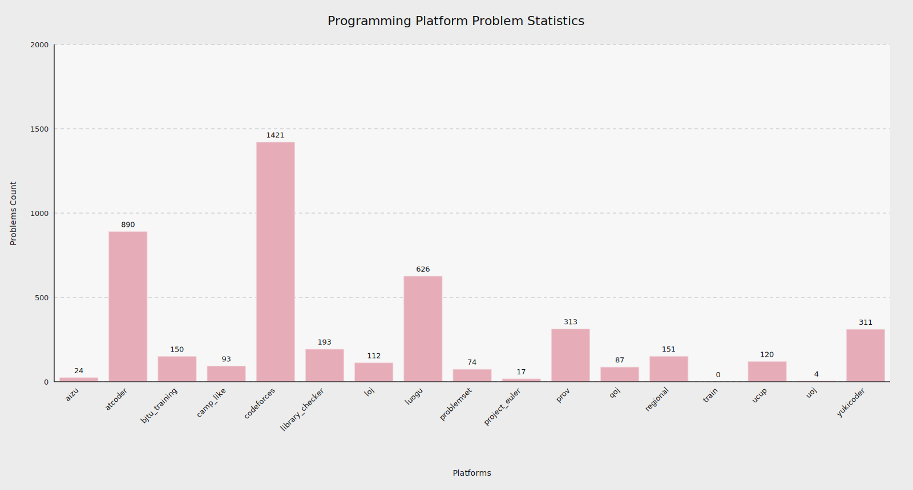

# Programming Problem Statistics



## Platform Statistics
#### Summary (since 2024/12)
- 2026/04/30   problems: 4025;
- 2026/03/31   problems: 3885;
- 2026/02/28   problems: 3610;
- 2026/01/09   problems: 3332;
- 2025/12/09   problems: 3199;
- 2025/11/25   problems: 3156;
- 2025/10/18   problems: 3106;
- 2025/09/26   problems: 3039;
- 2025/08/14   problems: 2711;
- 2025/07/26   problems: 2652;
- 2025/06/30   problems: 2400;
- 2025/05/27   problems: 2096;
- 2025/04/28   problems: 1842;
- 2025/03/31   problems: 1514;
- 2025/02/28   problems: 1096;
- 2025/01/30   problems: 833;
- 2024/12/31   problems: 485;
#### History (since 2025/03/12)
- 2026/04/30
  ```sh
  ├── library_checker
  │   └── Dynamic_Graph_Vertex_Add_Component_Sum.cpp [cover] | Three_Edge_Connected_Components.cpp
  └── luogu
      └── P5247.cpp | P6658.cpp
  ```
- 2026/04/29
  ```sh
  └── loj
      └── 122_强制在线_动态图连通性.cpp
  ```
- 2026/04/27
  ```sh
  ├── loj
  │   └── 191_无向图四元环计数.cpp | 193_线段树历史和.cpp
  └── luogu
      ├── B
      │   └── B3611.cpp | B3656.cpp | B3694.cpp | B3861.cpp
      └── P13270.cpp | P13825.cpp | P2406.cpp | P2424.cpp | P4137.cpp [cover] | P6815.cpp | P7173.cpp | P9611.cpp
  ```
- 2026/04/22
  ```sh
  ├── loj
  │   └── 6277_数列分块入门_1.cpp | 6278_数列分块入门_2.cpp | 6279_数列分块入门_3.cpp | 6280_数列分块入门_4.cpp | 6281_数列分块入门_5.cpp | 6282_数列分块入门_6.cpp | 6283_数列分块入门_7.cpp | 6284_数列分块入门_8.cpp | 6285_数列分块入门_9.cpp
  └── luogu
      └── P13984.cpp
  ```
- 2026/04/21
  ```sh
  ├── loj
  │   └── 10141_一本通_4_5_练习_3_染色.cpp | 2125_HAOI_2015_树上操作.cpp | 2874_JOISC_2014_Day_1_历史研究.cpp | 6208_树上询问.cpp | 6_猜数字_2.cpp
  └── luogu
      └── P2486.cpp [cover] | P3178.cpp [cover] | P3690.cpp [cover] | P3740.cpp
  ```
- 2026/04/20
  ```sh
  └── luogu
      └── P2014.cpp
  ```
- 2026/04/21
  ```sh
  └── loj
      └── 184_单位蒙日矩阵乘法.cpp [cover] | 186_动态树.cpp | 187_最小斯坦纳树.cpp | 188_可并堆.cpp
  ```
- 2026/04/20
  ```sh
  └── loj
      └── 127_最大流_加强版.cpp [cover] | 141_回文子串.cpp | 145_DFS_序_2.cpp | 146_DFS_序_3_树上差分_1.cpp | 147_DFS_序_4.cpp | 150_挑战多项式.cpp | 152_子集卷积.cpp | 153_集合覆盖计数.cpp | 160_树形背包.cpp | 162_快速幂_2.cpp [cover] | 164_高精度除法.cpp [cover] | 165_拉格朗日插值.cpp | 166_拉格朗日插值_2.cpp | 167_康托展开.cpp | 171_最长公共子串.cpp | 172_多项式欧几里得.cpp | 173_Runs.cpp | 178_多项式求根.cpp | 179_Nim_积.cpp
  ```
- 2026/04/20
  ```sh
  └── loj
      └── 101_最大流.cpp [cover] | 102_最小费用流.cpp [cover] | 103_子串查找.cpp | 104_普通平衡树.cpp | 105_文艺平衡树.cpp | 108_多项式乘法.cpp | 109_并查集.cpp | 110_乘法逆元.cpp | 111_后缀排序.cpp | 112_三维偏序.cpp | 113_最大异或和.cpp | 114_k_大异或和.cpp | 115_无源汇有上下界可行流.cpp | 116_有源汇有上下界最大流.cpp | 117_有源汇有上下界最小流.cpp | 118_正则表达式.cpp | 119_单源最短路.cpp | 123_最小生成树.cpp | 124_除数函数求和_1.cpp | 129_Lyndon_分解.cpp | 130_树状数组_1_单点修改_区间查询.cpp | 131_树状数组_2_区间修改_单点查询.cpp | 132_树状数组_3_区间修改_区间查询.cpp | 133_二维树状数组_1_单点修改_区间查询.cpp | 134_二维树状数组_2_区间修改_单点查询.cpp | 136_最小瓶颈路.cpp | 137_最小瓶颈路_加强版.cpp | 139_树链剖分.cpp | 143_质数判定.cpp | 144_DFS_序_1.cpp
  ```
- 2026/04/19
  ```sh
  ├── library_checker
  │   └── Jump_on_Tree.cpp [cover] | Lowest_Common_Ancestor.cpp | Point_Set_Tree_Path_Composite_Sum.cpp | Point_Set_Tree_Path_Composite_Sum_Fixed_Root.cpp | Rooted_Tree_Isomorphism_Classification.cpp [cover] | Rooted_Tree_Topological_Order_with_Minimum_Inversions.cpp | Vertex_Add_Path_Sum.cpp [cover] | Vertex_Set_Path_Composite.cpp [cover]
  └── loj
      └── 100_矩阵乘法.cpp | 11_Shared_Memory_Test.cpp | 161_乘法逆元_2.cpp | 4_Quine.py | 7_Input_Test.cpp
  ```
- 2026/04/19
  ```sh
  └── library_checker
      └── Dynamic_Tree_Vertex_Add_Subtree_Sum.cpp [cover] | Dynamic_Tree_Vertex_Set_Path_Composite.cpp [cover]
  ```
- 2026/04/18
  ```sh
  └── library_checker
      └── Dynamic_Tree_Vertex_Add_Path_Sum.cpp [cover]
  ```
- 2026/04/17
  ```sh
  ├── library_checker
  │   └── Cartesian_Tree.cpp | Dynamic_Tree_Subtree_Add_Subtree_Sum.cpp [cover] | Eertree.cpp [cover] | Enumerate_Palindromes.cpp [cover] | Longest_Common_Substring.cpp [cover] | Lyndon_Factorization.cpp [cover] | Number_of_Substrings.cpp [cover] | Palindromes_in_Deque.cpp [cover] | Prefix_Substring_LCS.cpp [cover] | Run_Enumerate.cpp [cover] | Sqrt_Mod.cpp [cover]
  ├── loj
  │   └── 2230_BJOI_2014_大融合.cpp
  └── luogu
      └── P5854.cpp | P8406.cpp [cover]
  ```
- 2026/04/16
  ```sh
  └── library_checker
      └── Consecutive_Terms_of_Linear_Recurrent_Sequence.cpp | Kth_term_of_Linearly_Recurrent_Sequence.cpp [cover] | Longest_Increasing_Subsequence.cpp [cover]
  ```
- 2026/04/15
  ```sh
  ├── library_checker
  │   └── Dirichlet_Convolution_and_Prefix_Sums.cpp [cover] | Discrete_Logarithm_Fixed_Mod.cpp [cover] | Enumerate_Quotients.cpp [cover] | Factorize.cpp [cover] | Kth_Root_Integer.cpp [cover] | Min_of_Mod_of_Linear.cpp [cover] | Primality_Test.cpp [cover] | Rational_Approximation.cpp | Sum_of_Floor_of_Linear.cpp | Sum_of_Multiplicative_Function.cpp | Sum_of_Totient_Function.cpp | Tetration_Mod.cpp
  └── luogu
      └── P11175.cpp [cover] | P3846.cpp | P4195.cpp [cover] | P5325.cpp
  ```
- 2026/04/14
  ```sh
  └── luogu
      └── P4213.cpp [cover]
  ```
- 2026/04/13
  ```sh
  ├── library_checker
  │   └── Bernoulli_Number.cpp [cover] | Connected_Components_of_Complement_Graph.cpp | Cycle_Detection_Directed.cpp [cover] | Cycle_Detection_Undirected.cpp [cover] | Dominator_Tree.cpp [cover] | Enumerate_Cliques.cpp [cover] | Enumerate_Triangles.cpp [cover] | Eulerian_Trail_Directed.cpp [cover] | Eulerian_Trail_Undirected.cpp [cover] | Incremental_Minimum_Spanning_Forest.cpp [cover] | K_Shortest_Walk.cpp [cover] | Matching_on_General_Graph.cpp [cover] | Maximum_Independent_Set.cpp [cover] | Minimum_Cost_b_flow.cpp [cover] | Minimum_Spanning_Tree.cpp [cover] | Minimum_Steiner_Tree.cpp [cover] | Shortest_Path.cpp [cover] | Static_Rectangle_Add_Rectangle_Sum.cpp | Strongly_Connected_Components.cpp | Two_Edge_Connected_Components.cpp [cover]
  └── luogu
      └── P4043.cpp [cover]
  ```
- 2026/04/12
  ```sh
  ├── library_checker
  │   └── Biconnected_Components.cpp | Static_Range_Inversions_Query.cpp [cover] | Static_Range_LIS_Query.cpp [cover]
  └── luogu
      └── P2075.cpp [cover]
  ```
- 2026/04/11
  ```sh
  ├── library_checker
  │   └── Rectangle_Add_Point_Get.cpp [cover]
  └── yukicoder
      ├── 0200-0300
      │   └── No_296_n度寝.cpp | No_297_カードの数式.cpp | No_298_話の伝達.cpp | No_299_蟻本が読めない.cpp
      └── 0300-0400
          └── No_300_平方数.cpp | No_301_サイコロで確率問題_1.cpp | No_302_サイコロで確率問題_2.cpp | No_303_割れません.cpp
  ```
- 2026/04/10
  ```sh
  └── library_checker
      └── Persistent_Range_Affine_Range_Sum.cpp [cover] | Persistent_Unionfind.cpp | Range_Set_Range_Composite.cpp [cover] | Rectangle_Add_Point_Get.cpp
  ```
- 2026/04/09
  ```sh
  ├── loj
  │   └── 3800_HEOI_2013_Segment.cpp
  └── luogu
      └── P10602.cpp
  ```
- 2026/04/08
  ```sh
  ├── library_checker
  │   └── Dynamic_Sequence_Range_Affine_Range_Sum.cpp
  └── luogu
      └── P3383.cpp [cover] | P4097.cpp [cover]
  ```
- 2026/04/05
  ```sh
  └── luogu
      └── P3052.cpp | P3098.cpp
  ```
- 2026/04/04
  ```sh
  └── yukicoder
      └── 0200-0300
          └── No_284_門松と魔法_2.cpp | No_287_場合の数.cpp | No_288_貯金箱の仕事.cpp | No_289_数字を全て足そう.cpp | No_290_1010.cpp | No_291_黒い文字列.cpp | No_292_芸名.cpp | No_293_4_7_の世界.cpp | No_294_SuperFizzBuzz.cpp | No_295_hel_world.cpp
  ```
- 2026/04/03
  ```sh
  └── yukicoder
      └── 0200-0300
          └── No_285_消費税.cpp | No_286_Modulo_Discount_Store.cpp
  ```
- 2026/04/03
  ```sh
  └── yukicoder
      └── 0200-0300
          └── No_283_スライドパズルと魔方陣.cpp
  ```
- 2026/03/31
  - Luogu P12197 P1400 P1752 P1791 P3059 P4244 P9401
- 2026/03/30
  - Luogu P11278 P1411 P14551 P15461 P1691 P1797 P3219
  - yukicoder No_270
  - Library_checker
    - Nim_Product_F_264_mathbb_F_2_64_F_264
- 2026/03/29
  - Uoj U419
- 2026/03/28
  - Luogu P14578 P14579 P14580
- 2026/03/27
  - Library_checker
    - Stern_Brocot_Tree
  - Luogu P1222 P1819 P3856
- 2026/03/26
  - Library_checker
    - Range_Affine_Range_Sum_Large_Array
  - yukicoder No_271 No_272 No_273 No_274 No_275 No_276 No_277 No_278 No_279 No_280 No_281 No_282
- 2026/03/25
  - yukicoder No_267 No_268 No_269
  - project_euler 12 | 13 | 14 | 15 | 16 | 17
- 2026/03/24
  - yukicoder No_264 No_265 No_266
- 2026/03/23
  - project_euler 10 | 11 | 4 | 5 | 6 | 7 | 8 | 9
- 2026/03/22
  - ucup4-ex-4 - J M
- 2026/03/21
  - Luogu P4779
- 2026/03/19
  - ucup1-9 - C D E F J L M
- 2026/03/18
  - Luogu P5487
  - yukicoder No_261 No_262 No_263
- 2026/03/17
  - yukicoder No_260
- 2026/03/16
  - Luogu P9896
  - project_euler 3
  - yukicoder No_249 No_250 No_251 No_252 No_253 No_254 No_255 No_256 No_257 No_258 No_259
- 2026/03/15
  - yukicoder No_244 No_245 No_246 No_247 No_248
- 2026/03/14
  - project_euler 1 | 2
  - yukicoder No_177 No_231 No_232 No_233 No_234 No_235 No_236 No_237 No_238 No_239 No_240 No_241 No_242 No_243
- 2026/03/12
  - yukicoder No_216 No_217 No_218 No_219 No_220 No_221 No_222 No_223 No_224 No_225 No_226 No_227 No_228 No_229 No_230
- 2026/03/11
  - Luogu P13813 P13814
  - ucup8 - I J
- 2026/03/10
  - Luogu P13805 P13806 P6626
  - ucup8 - A B C D E F G K L
- 2026/03/09
  - Library_checker
    - Dirichlet_Convolution_and_Prefix_Sums | Dirichlet_Inverse_and_Prefix_Sums | Kth_Root_Integer
  - Luogu P2442 P9875
- 2026/03/08
  - Luogu P1500 P2387 P3324 P4234 P4971
- 2026/03/07
  - Loj L2718 L3520 L3948 L4831 
  - Luogu P4602 P4768 P6619 P7803 P9120 P9622 P9625 P12913
  - Library_checker
    - Incremental_Minimum_Spanning_Forest
  - Uoj U3
- 2026/03/06
  - Loj L5079
  - Luogu P12771 P3278
  - yukicoder No_212 No_213 No_214 No_215
- 2026/03/05
  - yukicoder No_201 No_202 No_203 No_204 No_205 No_206 No_207 No_208 No_209 No_210 No_211
- 2026/03/05
  - Library_checker
    - Multiplication_of_Big_Integers
  - Luogu P1919 P4245
  - yukicoder No_182 No_183 No_184 No_185 No_186 No_187 No_188 No_189 No_190 No_191 No_192 No_193 No_194 No_195 No_196 No_197 No_198 No_199 No_200
- 2026/03/04
  - Luogu P12044 P14420 P3374 P4151
  - Library_checker
    - Multipoint_Evaluation_Geometric_Sequence | Product_of_Polynomial_Sequence
  - Luogu P4726 P5264 P5265 P5383 P5394 P5809 P5827 P5828 P7364
- 2026/03/03
  - Library_checker
    - Composition_of_Formal_Power_Series_Large | Compositional_Inverse_of_Formal_Power_Series_Large | Inv_of_Formal_Power_Series          
    - Kth_term_of_Linearly_Recurrent_Sequence  | Sqrt_of_Formal_Power_Series                        | Vertex_Add_Range_Contour_Sum_on_Tree
  - Luogu P10249 P15107 P2076 P3803 P4238 P4245 P4512 P4723 P4725 P5050 P5282 P5393 P6329
- 2026/03/02
  - Library_checker
    - Composition_of_Formal_Power_Series | Convolution                                 | Exp_of_Formal_Power_Series
    - Log_of_Formal_Power_Series         | Polynomial_Interpolation_Geometric_Sequence | Polynomial_Taylor_Shift   
  - Luogu P14993 P5158 P6800 P6828
- 2026/03/01
  - Library_checker
    - Minimum_Spanning_Tree | Pow_of_Formal_Power_Series
  - Luogu P5205
- 2026/02/28
  - yukicoder No_173 No_174 No_175 No_176 No_178 No_179 No_180 No_181
- 2026/02/27
  - yukicoder No_151 No_152 No_153 No_154 No_155 No_156 No_157 No_158 No_159 No_160 No_161 No_162 No_163 No_164 No_165 No_166 No_167 No_168 No_169 No_170 No_171 No_172
  - yukicoder No_3
- 2026/02/26
  - Library_checker
    - Discrete_Logarithm_Fixed_Mod        | Dynamic_Graph_Vertex_Add_Component_Sum | Dynamic_Tree_Vertex_Add_Path_Sum
    - Dynamic_Tree_Vertex_Add_Subtree_Sum | Dynamic_Tree_Vertex_Set_Path_Composite | Enumerate_Quotients             
    - Line_Add_Get_Min                    | Log_of_Set_Power_Series               
  - Luogu P11175
  - 2025ICPConline1 - K
- 2026/02/25
  - Library_checker
    - Associative_Array  | Point_Set_Range_Frequency | Range_Add_Range_Min
    - Static_Convex_Hull
- 2026/02/24
  - Library_checker
    - Convex_Layers                          | Enumerate_Primes       | Factorial         
    - Many_Factorials                        | Number_of_Subsequences | Partition_Function
    - Shift_of_Sampling_Points_of_Polynomial
  - Luogu P5667
  - yukicoder No_148 No_149 No_150
- 2026/02/23
  - yukicoder No_139 No_140 No_141 No_142 No_143 No_144 No_145 No_146 No_147
- 2026/02/22
  - Luogu P2197 P4980
  - ucup1-7 - E G H I K
  - yukicoder No_102 No_114 No_122 No_125 No_126 No_127 No_128 No_129 No_130 No_131 No_132 No_133 No_134 No_135 No_136 No_137 No_138 No_90
- 2026/02/21
  - Library_checker
    - Polynomial_Composite_Set_Power_Series
  - Luogu P10461 P12230 P12231 P12232 P6097 P6329
  - yukicoder No_119 No_120 No_121 No_123 No_124
- 2026/02/20
  - yukicoder No_100 No_101 No_103 No_104 No_105 No_106 No_107 No_108 No_109 No_110 No_111 No_112 No_113 No_115 No_116 No_117 No_118 No_94 No_95 No_96 No_97 No_98 No_99
- 2026/02/19
  - at fps_24 - B D F_matpow H J L N O
  - yukicoder No_81 No_82 No_83 No_84 No_85 No_86 No_87 No_88 No_89 No_91 No_92 No_93
- 2026/02/18
  - yukicoder No_65 No_66 No_67 No_68 No_69 No_70 No_71 No_72 No_73 No_74 No_75 No_76 No_77 No_78 No_79 No_80
- 2026/02/17
  - at fps_24 - S
  - yukicoder No_61 No_62 No_63 No_64
- 2026/02/16
  - yukicoder No_16 No_28 No_29 No_30 No_41 No_42 No_43 No_44 No_45 No_46 No_47 No_48 No_49 No_50 No_51 No_52 No_53 No_54 No_55 No_56 No_57 No_58 No_59 No_60
- 2026/02/14
  - Luogu P5900 P6613
- 2026/02/13
  - Luogu P3261
- 2026/02/12
  - Luogu P14302
- 2026/02/11
  - yukicoder No_31 No_32 No_33 No_34 No_35 No_36 No_37 No_38 No_39 No_40
- 2026/02/09
  - yukicoder No_12 No_13 No_14 No_15 No_17 No_18 No_19 No_20 No_21 No_22 No_23 No_24 No_25 No_26 No_27
- 2026/02/07
  - yukicoder No_10 No_11
- 2026/02/06
  - Loj L150 L150
  - at fps_24 - S_ofps
  - Uoj U50
- 2026/02/01
  - 2020CCPCfinal - E L
- 2026/01/31
  - 2020CCPCfinal - F
- 2026/01/29
  - Library_checker
    - Min_of_Mod_of_Linear
- 2026/01/27
  - Luogu P2764 P3355 P7368
  - 2022CCPCfinal - D F H
- 2026/01/26
  - Luogu P4198 P4560 P5490 P8024
- 2026/01/25
  - Luogu P3402
- 2026/01/24
  - 2021ECfinal - A D I L
  - ucup3-37 - A
- 2026/01/23
  - at fps_24 - A C E F G I K M P Q R T
- 2026/01/21
  - Luogu P1012 P5607
  - 2023CCPCfinal - D G H
- 2026/01/20
  - Loj L6268
  - Luogu P4071
  - ICPC2022ECfinal - H I J
- 2026/01/18
  - Luogu P4705
  - CCPC2025final - C
- 2026/01/17
  - Luogu P2767 P5219
  - 2025CCPC济南 - E F
- 2026/01/16
  - Luogu P5827 P5828 P6295
- 2026/01/15
  - ucup1-7 - M
- 2026/01/14
  - Luogu P2157
  - ucup1-6 - H J L
- 2026/01/13
  - Luogu P2056 P3426 P4103 P4135 P4655
  - ucup1-6 - A B C D G I M
- 2026/01/12
  - Luogu P2605 P3586 P3723 P5356
- 2026/01/11
  - Loj L5032
  - cf_2183 hello2026 - H
  - Luogu P12736 P2839 P3295 P3302 P3825
  - ucup1-3 - M
- 2026/01/10
  - ucup1-3 - K
  - ucup1-4 - A B D E F G I J K
- 2026/01/09
  - 2022HK - D
- 2026/01/05
  - ucup1-3 - A B C D G I
- 2026/01/03
  - 2022HK - I
- 2026/01/02
  - 2022HK - A B C E F H K L
- 2025/12/21
  - Library_checker
    - Binomial_Coefficient_Prime_Mod     | Stirling_Number_of_the_First_Kind          | Stirling_Number_of_the_First_Kind_Fixed_K
    - Stirling_Number_of_the_Second_Kind | Stirling_Number_of_the_Second_Kind_Fixed_K
- 2025/01/09
  - P10283 P1912 P3045 P3476 P3515 P3546 P3564 P3763 P3765 P3988 P4013 P4117 P4197 P4214 P4309 P4334 P4390 P4463 P4553 P4572 P4592 P4609 P4735 P4743 P4767 P4847 P4980 P4983 P5028 P5231 P5308 P5432 P5574 P5808 P5825 P5896 P6021 P6062 P6078 P6246 P6378 P7456 P7834 P8021 P9062
  - loj_6074
- 2025/01/01
  - Library_checker Min_Plus_Convolution_Convex_and_Arbitrary.cpp | Min_Plus_Convolution_Convex_and_Convex.cpp | Point_Set_Range_Sort_Range_Composite.cpp | Bell_Number.cpp | Bernoulli_Number.cpp | Composition_of_Formal_Power_Series.cpp | Composition_of_Formal_Power_Series_Large.cpp | Compositional_Inverse_of_Formal_Power_Series.cpp | Compositional_Inverse_of_Formal_Power_Series_Large.cpp | Division_of_Polynomials.cpp | Exp_of_Formal_Power_Series.cpp | Find_Linear_Recurrence.cpp | Inv_of_Formal_Power_Series.cpp | Inv_of_Polynomials.cpp | Kth_term_of_Linearly_Recurrent_Sequence.cpp | Log_of_Formal_Power_Series.cpp | Many_Factorials.cpp | Multipoint_Evaluation.cpp | Multipoint_Evaluation_Geometric_Sequence.cpp | Polynomial_Interpolation.cpp | Polynomial_Interpolation_Geometric_Sequence.cpp | Polynomial_Root_Finding_Mod_998244353.cpp | Polynomial_Taylor_Shift.cpp | Pow_of_Formal_Power_Series.cpp | Product_of_Polynomial_Sequence.cpp | Sqrt_of_Formal_Power_Series.cpp | p_p_p_Subset_Sum.cpp
  - yokicoder No_1145 No_42
  - P10249 P11175 P14802 P1776 P2000 P2590 P2871 P3165 P3321 P3377 P3803 P3871 P4008 P4146 P4389 P4402 P4451 P4482 P4491 P4512 P4567 P4721 P4723 P4781 P4841 P5050 P5110 P5158 P5264 P5265 P5277 P5282 P5338 P5349 P5373 P5383 P5393 P5394 P5395 P5396 P5408 P5409 P5488 P5491 P5641 P5667 P5748 P5809 P5824 P6012 P6613 P6800 P6828 P7364
  - THUPC 2025
  - cf 2174 -DE
  - cf 2178 -IH
  - cf 2180 -CFGH
  - loj_162 loj_164
- 2025/12/09
  - loj_2625
  - P10689 P11620 P14513 P1527 P1912 P2178 P3232 P3292 P3515 P3810 P3980 P4197 P4254 P4839 P5503
- 2025/12/02
  - 98 cf beta78 -ak
  - 99 cf beta78 -ak
  - P13014 P1552 P2152 P2473 P2596 P3201 P3338 P3387 P3527 P3629 P3648 P3967 P4051 P4072 P4196 P4360 P4767 P5494 P6178 P6577
- 2025/11/25
  - P1048 P1537 P2444 P3327 P3391 P4036 P5906 P6329
  - Library_checker Vertex_Add_Range_Contour_Sum_on_Tree
  - 2025 南京
  - 2025 沈阳
  - 78 cf_beta70 -ak
  - 79 cf_beta71 -ak
  - 83 cf_beta72 -ak
  - 84 cf_beta72 -ak
  - 87 cf_beta73 -ak
  - 88 cf_beta73 -ak
  - 89 cf_beta74 -ak
  - 90 cf_beta74 -ak
  - 91 cf_beta75 -D
  - 92 cf_beta75 -ak
  - 93 cf_beta76 -ak
  - 94 cf_beta76 -ak
  - 95 cf_beta77 -ak
  - 96 cf_beta77 -ak
  - HNCPC2025
- 2025/11/10
  - 2020 沈阳
  - 2022 杭州
  - 2025 女生
  - 2025 成都
  - 2025 武汉
  - 2025 西安
  - ucup3-27
  - ucup3-28
  - P1501 P2147 P2173 P2387 P2542 P3203 P3206 P3478 P3690 P3793 P3976 P4115 P4145 P4219 P4230 P4234 P4271 P4319 P4332 P4546 P4751 P4782 P5024 P5043 P5354 P5489 P5622 P5649 P6097 P6292 P6664 P7735
  - Library_checker Dynamic_Tree_Subtree_Add_Subtree_Sum.cpp | Rooted_Tree_Isomorphism_Classification.cpp | Tree_Path_Composite_Sum.cpp
- 2025/10/18
  - ucup3-1
  - ucup3-10
  - ucup3-13
  - ucup3-15
  - ucup3-2
  - ucup3-21
  - ucup3-24
  - ucup3-3
  - ucup3-4
  - ucup3-7
  - ucup3-8
  - ucup4-2
  - Library_checker Rooted_Tree_Isomorphism_Classification | Tree_Path_Composite_Sum
  - 77 cf beta69 -ak
  - 2018 青岛
  - 2020 沈阳
  - 2021 沈阳
  - 2023 桂林
  - 2025 GCPC
  - P10639 P11615 P1175 P1972 P2312 P2408 P3292 P3372 P3521 P3538 P3567 P3804 P3925 P3950 P3975 P3976 P3979 P4070 P4151 P4211 P4216 P4248 P4315 P4320 P4323 P4606 P4616 P4630 P5043 P5273 P5305 P6157 P7735 P7911 P8289 P8496 P8815 P8969
- 2025/09/26
  - 2019 HNCPC -ak
  - 2025 SHCPC
  - 2019 SCCPC -F K
  - P_2521 P_2835 P_5214 P_6492 P_7251 P_8460
  - Library_checker Exp_of_Formal_Power_Series_Sparse | Inv_of_Formal_Power_Series_Sparse | Log_of_Formal_Power_Series_Sparse | Pow_of_Formal_Power_Series_Sparse | Sqrt_of_Formal_Power_Series_Sparse
  - 66 cf beta61 -ak
  - 68 cf beta62 -ak
  - 69 cf beta63 -ak
  - 70 cf beta64 -ak
  - 71 cf beta65 -ak
  - 73 cf beta66 -ak
  - 75 cf beta67 -ak
  - 76 cf beta68 -ak
  - 80 cf beta69 -ak
- 2025/09/16
  - JXCPC -J M
  - Library_checker Addition_of_Big_Integers | Division_of_Big_Integers | Minimum_Enclosing_Circle
  - Library_checker Minimum_Steiner_Tree | Multiplication_of_Big_Integers | Range_Add_Range_Min
  - ICPC online1
  - ICPC online2
  - P_3376
  - 2085 cf1011 -ak
  - 2086 edu177 -F
  - 2092 cf1014 -ak
  - 65 cf beta60 -E
- 2025/09/11
  - Library_checker 
    - Sort_Points_by_Argument | Determinant_of_Matrix | Determinant_of_Matrix_Arbitrary_Mod 
    - Inverse_Matrix | Matrix_Product | Pow_of_Matrix | Rank_of_Matrix | System_of_Linear_Equations 
    - Enumerate_Palindromes | Lyndon_Factorization | Palindromes_in_Deque | Prefix_Substring_LCS
    - Run_Enumerate | Wildcard_Pattern_Matching | Z_Algorithm | Eertree
  - P_4722 P_6114
- 2025/09/10
  - Library_checker Closest_Pair_of_Points | Furthest_Pair_of_Points | Manhattan_MST
  - HNCPC2018 -ak
  - AIZU geo -upd
  - P_1257 P_1429 P_1452 P_2742 P_4357 P_4423 P_4557 P_7883
  - cf beta53 -D
  - cf beta54 -E
  - cf beta55 -ak
  - cf beta56 -ak
  - cf beta57 -ak
  - cf beta58 -ak
  - cf beta59 -ak
- 2025/09/01
  - Library_checker 
    - 一般图最大匹配
  - luogu
    - 很多很多题
  - 多校
    - upd
  - thucamp
    - upd
- 2025/08/14
  - Library_checker 
    - Convolution_Large | Convolution_Mod_2_64 | Deque | Exp_of_Formal_Power_Series | Factorial | Factorize | 
    - Gcd_Convolution | Inv_of_Formal_Power_Series | Lcm_Convolution | Log_of_Formal_Power_Series | 
    - Pow_of_Formal_Power_Series | Sqrt_Mod | Sqrt_of_Formal_Power_Series
  - P_3649 P_4287 P_4762 P_5496 P_5555 P_5685
- 2025/08/12
  - 2127 cf1041 -G
  - 2129 cf1040 -C23 E F
  - Library_checker 
    - Assignment_Problem | Chromatic_Number | Cycle_Detection_Directed | Cycle_Detection_Undirected | 
    - Dominator_Tree | Enumerate_Cliques | Enumerate_Triangles | Eulerian_Trail_Directed | Eulerian_Trail_Undirected | 
    - Exp_of_Set_Power_Series | Longest_Increasing_Subsequence | Majority_Voting | Maximum_Independent_Set | 
    - Minimum_Cost_b_flow | Point_Add_Rectangle_Sum | Range_Chmin_Chmax_Add_Range_Sum | Range_Set_Range_Composite | 
    - Rectangle_Sum | Shortest_Path | Static_Range_Sum_with_Upper_Bound | Vertex_Add_Range_Contour_Sum_on_Tree | 
    - Vertex_Get_Range_Contour_Add_on_Tree
  - P_10461 P_10603 P_12230 P_12231 P_12232 P_2075 P_3806 P_4239 P_5264 P_5667 P_6097 P_6192 P_6329 P_6800
  - loj_184
- 2025/07/26
  - hdu 1
  - hdu 2
  - hdu 3
  - nowcode 1
  - nowcode 2
  - nowcode 3
  - nowcode 4
  - 2097 cf1021 -F
  - 2098 cf1021 -ak
  - 2106 cf1020 -G
  - 2122 cf1038 -?
  - 2125 edu181 -F
  - Library_checker Longest_Common_Substring | Number_of_Substrings | Suffix_Array | Two_Edge_Connected_Components
  - P_13310 P_3809 P_6656
  - abc414 -FG
  - abc415 -ak
  - loj_6235
  - qoj 2244 XXI 赛前模板训练赛
- 2025/07/11
  - 2101 cf1024 -EFG (div1)
  - 2009 cf1025 -F
  - 2102 cf1024 -ak
  - 2110 cf1026 -ak
  - Library_checker Static_Range_LIS_Query
- 2025/07/10
  - abc413 -ak
  - 2114 cf1027 -ak
  - 2116 cf1028 -EF
  - 2119 cf1025 -EF
  - 2142 cf1036 -F2GHI
  - 105668 MITIT 2025 begin -ak
- 2025/07/04
  - 2014 HNCPC -J
  - 2016 HNCPC -K
  - 2111 edu179 -G
  - 2117 cf1029 -ak
  - 2123 cf1034 -ak
  - 56 cf_beta52 -ak
- 2025/06/30
  - 2118 cf1030 -F
  - abc412 -G
  - P_3810
- 2025/06/28
  - 2120 cf1033 -G | div2
  - 2121 cf1032 -ak | div3
  - 2112 edu180 -ak
  - abc411 -ak
  - abc410 -ak
  - arc222 -CDE
  - arc223 -DF
  - 2025四川
  - 2025重庆
- 2025/06/20
  - 47 cf_beta44 -ak
  - 48 cf_beta45 -H
  - 49 cf_beta46 -ak
  - 50 cf_beta47 -ak
  - 51 cf_beta48 -ak
  - 53 cf_beta49 -ak
  - 54 cf_beta50 -ak
  - 55 cf_beta51 -ak
  - P_1989
- 2025/06/18
  - P_5179
  - Yukicoder No_1 No_2 No_3 No_4 No_5 No_6 No_7 No_8 No_9
  - 2113 cf1031 div2 -E
  - 38 cf_beta38 -H
  - 40 cf_beta39 -ak
  - 41 cf_beta40 -ak
  - 42 cf_beta41 -ak
  - 43 cf_beta42 -ak
  - 47 cf_beta43 -ak
- 2025/06/17
  - Aizu geometry 缺少小部分模板
  - nwerc2024 -B C G I 
  - abc408 -ak
- 2025/06/13
  - 2025山东省赛 -B
  - 2025南昌省赛 -B -J
  - 2025陕西 -4
  - 2022河南省赛 -C -D -L
- 2025/06/12
  - Library_checker Dynamic_Tree_Vertex_Add_Subtree_Sum | Counting_Primes | Discrete_Logarithm | Primality_Test | 
  - Dynamic_Tree_Vertex_Add_Path_Sum | Dynamic_Tree_Vertex_Set_Path_Composite
  - Library_checker Area_of_Union_of_Rectangles | Vertex_Set_Path_Composite | Vertex_Add_Path_Sum | Bitwise_Xor_Convolution | 
  - Library_checker Bitwise_And_Convolution | Jump_on_Tree | Subset_Convolution | Point_Set_Range_Sort_Range_Composite | 
  - Library_checker Tree_Diameter | Vertex_Add_Subtree_Sum | Convolution_Mod_1_000_000_007
- 2025/06/10
  - abc409 -ak
  - Library_checker Segment_Add_Get_Min | Queue_Operate_All_Composite | Set_Xor_Min | Rectangle_Sum | Static_Range_Frequency |
  - Library_checker Line_Add_Get_Min | Static_Range_Mode_Query | Static_Range_Count_Distinct | Static_Range_Inversions_Query |
  - Library_checker Multiplication_of_Big_Integers | Addition_of_Big_Integers | Range_Reverse_Range_Sum
- 2025/06/07
  - 2025 河北 -B -L
- 2025/06/06
  - P_5494 P_3368 P_5631 P_4556 P_3803 P_5050 P_3374 P_5245 P_5205 P_4512 P_5158 P_4245 P_4726 
  - P_4238 P_3224 P_10814 P_4718 P_4725
  - 2025 河南 -A -I
  - 05-21 BJTU训练赛 -I
- 2025/06/03
  - 2025 吉林省赛 -3
- 2025/05/26
  - 557 cf311 -ak
  - Library_checker Persistent_Range_Affine_Range_Sum | Point_Set_Range_Composite | Static_Range_Sum | 
  - Library_checker Static_RMQ | Point_Set_Range_Composite_Large_Array | Ordered_Set | 
  - Library_checker Range_Affine_Point_Get | Range_Affine_Range_Sum_Large_Array | Range_Affine_Range_Sum | 
  - Library_checker Point_Add_Range_Sum
  - P_2710 P_2042
  - loj_2097
  - 2020 四川省赛
  - abc406 -G
  - abc407 -ak
  - arc198 -E
- 2025/05/23
  - P_6136 P_4137 P_1486 P_8306 P_4234 P_2906 P_2410 P_3373 P_2824 P_3806 P_1648 
  - P_3730 P_2173 P_4915 P_3168 P_1712 P_2234 P_3369 P_3402 P_2147 P_9989 P_5193 
  - P_3293 P_2286 P_4198 P_4314 P_4219 P_2633
  - loj_2097
- 2025/05/16
  - P_5283 P_4887 P_4462 P_5501 P_2163 P_5047
- 2025/05/15
  - Library_checker A_B | K_Shortest_Walk | Many_A_B_128_bit | Many_A_B
  - Library_checker Associative_Array | Unionfind_with_Potential
  - Library_checker Unionfind | Double_Ended_Priority_Queue | Predecessor_Problem
  - P_2483 P_4555 P_4467 P_3649 P_5826 P_3500 P_7708
- 2025/05/13
  - 05-11 BJTU训练赛 -ak
  - 2021 四川省賽 -G
  - 546 cf304 -ak
  - P_12044
- 2025/05/10
  - abc218 -ak
  - abc405 -ak
  - 2107 cf1023 -ak
  - P_5787 P_5170 P_3384 P_2709 P_4306 P_5227 P_2900 P_3834 P_4513 P_5435 P_3919 P_2448
  - loj_138
- 2025/05/05
  - abc404 -ak
  - 05-03 BJTU训练赛 -ak
  - 05-04 BJTU训练赛 -ak
  - 05-05 BJTU训练赛 -ak
  - 525 cf297 -ak
  - 527 cf296 -ak
  - 665 edu12 -ak
- 2025/05/03
  - abc217 -ak
  - 04-30 BJTU训练赛 -ak
  - 05-02 BJTU训练赛 -ak
  - 2104 edu178 -F
  - 2108 cf1022 -ak
  - 514 cf291 -ak
  - 515 cf292 -ak
- 2025/04/27
  - abc403 -ak
- 2025/04/25
  - 32 cf_beta32 -ak
  - 33 cf_beta33 -E
  - 34 cf_beta34 -ak
  - 35 cf_beta35 -ak
  - 36 cf_beta36 -ak
  - 37 cf_beta37 -ak
- 2025/04/22
  - 04-23 BJTU训练赛 -ak
  - 30 cf_beta30 -ak
  - 31 cf_beta31 -ak
  - 505 cf286 -ak
  - 508 cf288 -ak
  - 1763 cf840 -ak
  - abc395 -ak
  - abc402 -G
- 2025/04/16
  - 04-16 BJTU训练赛 -ak
  - abc396 -ak
  - abc397 -ak
- 2025/04/15
  - 2094 cf1017(div 3) -ak
  - abc398 -ak
  - abc399 -G
  - abc400 -G
  - abc401 -ak
- 2025/04/13
  - 23 cf_beta23 -ak
  - 24 cf_beta24 -ak
  - 25 cf_beta25 -ak
  - 26 cf_beta26 -E
  - 27 cf_beta27 -ak
  - 28 cf_beta28 -E
  - 29 cf_beta29 -ak
- 2025/04/11
  - Loj_121
  - 18 cf_beta18 -ak
  - 19 cf_beta19 -ak
  - 20 cf_beta20 -ak
  - 21 cf_beta21 -ak
- 2025/04/09
  - P_4597
  - 12 cf_beta12 -ak
  - 13 cf_beta13 -ak
  - 14 cf_beta14 -ak
  - 15 cf_beta15 -ak
  - 16 cf_beta16 -ak
  - 17 cf_beta17 -ak
  - 2093 cf1016 -ak
- 2025/04/07
  - 10 cf_beta10 -ak
  - 11 cf_beta11 -E
  - P_2482 P_2764 P_4001 P_4195 P_4717 P_4721 P_5205 P_8819
- 2025/04/06
  - 9 cf_beta9 -ak
- 2025/04/05
  - 4 cf_beta4 -ak
  - 5 cf_beta5 -ak
  - 6 cf_beta6 -ak
  - 7 cf_beta7 -E
  - 8 cf_beta8 -ak
- 2025/04/04
  - 1 cf_beta1 -ak
  - 2 cf_beta2 -ak
  - 3 cf_beta3 -ak
  - 586 cf325 -ak
  - 899 cf452 -ak
- 2025/04/03
  - 22 cf22 -ak
  - 631 cf344 -ak
  - 1106 cf536 -F
  - 1282 cf610 -ak
- 2025/04/02
  - P_3372
  - 234 cf145 -ak
  - 712 cf370 -ak
  - 828 cf423 -F
- 2025/03/31
  - 03-31 BJTU第三届C语言积分赛 -ak
- 2025/03/28
  - 1398 edu93 -ak
  - 1665 cf781 -ak
  - P_1537 P_2375 P_3157 P_4213 P_8435 
  - Library_checker bcc
- 2025/03/27
  - 1380 edu91 -F
  - 1389 edu92 -G
- 2025/03/26
  - 2019 陕西省赛（组队） [-G]
- 2025/03/25
  - 2091 cf1013 div3 -ak
- 2025/03/24
  - P_4097 P_5785 P_9989 P_4983 
  - 李超树 [-2]
  - 凸优化 [-2]
- 2025/03/23
  - ZR 2024 B day1 斜率优化dp -ak
  - ZR 2024 B day1 状压dp [-4]
  - P_2657 P_2704 P_7519 P_7961 P_11714 P_4363 P_3195 P_3299 
- 2025/03/22 
  - 55 cf_beta51 -ak
  - Library_checker scc | BM
  - Loj_2384
  - P_3227 P_3386 P_3387 P_4003 P_6054
  - ZR 2024 A day1 上午(flow) [-7 -8 -13]
  - ZR 2024 B day1 数位dp [-5 -6 -7]
- 2025/03/21
  - 03-21 2025BJTU个人训练赛(7) Div III -ak
- 2025/03/20
  - 2075 edu176 -F
  - Loj_101 Loj_102 Loj_127 
  - P_1235 P_1561 P_2123 P_2144 P_2235 P_2293 P_2609 P_2613 P_3922 P_4204 P_4295
- 2025/03/19
  - 03-19 2025BJTU个人训练赛-LQ模式(6)-Div II -F
- 2025/03/17
  - P_2000 P_3367 P_4043 P_4708 P_4722 P_5468 P_9902 P_10509
  - 1373 edu90 -ak
- 2025/03/16
  - 03-16 2025BJTU个人训练赛(6) Div III -ak
  - 03-16 2025BJTU个人训练赛-ICPC模式(5) Div I -A -C
- 2025/03/15
  - 1366 edu89 -ak
  - 1359 edu88 -ak
  - 1354 edu87 -ak
- 2025/03/14
  - 03-14 2025BJTU个人训练赛(5) Div III -ak
  - 1342 edu86 -F
- 2025/03/13
  - 1334 edu85 -ak
  - 1327 edu84 -G
  - 105385 2024 山东邀请赛
- 2025/03/12
  - 1312 edu83 -F
  - 2074 cf1009 div(3) -ak
  - 1303 edu82 -G