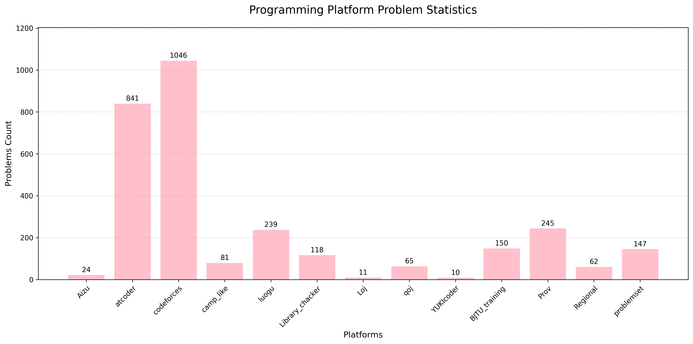

# Programming Problem Statistics

## Platform Statistics
#### Summary (since 2024/12)
- 2025/03/28   problems: 1499;
- 2025/02/28   problems: 1096;
- 2025/01/30   problems: 833;
- 2024/12/31   problems: 485;
#### History (since 2025/03/12)
- 2025/03/28
  - 1398 edu93 -ak
  - 1665 cf781 -ak
  - P_1537 P_2375 P_3157 P_4213 P_8435 
  - Library_checker bcc
- 2025/03/27
  - 1380 edu91 -F
  - 1389 edu92 -G
- 2025/03/26
  - 2019 陕西省赛（组队） [-G]
- 2025/03/25
  - 2091 cf1013 div3 -ak
- 2025/03/24
  - P_4097 P_5785 P_9989 P_4983 
  - 李超树 [-2]
  - 凸优化 [-2]
- 2025/03/23
  - ZR 2024 B day1 斜率优化dp -ak
  - ZR 2024 B day1 状压dp [-4]
  - P_2657 P_2704 P_7519 P_7961 P_11714 P_4363 P_3195 P_3299 
- 2025/03/22 
  - 55 cf_beta51 -ak
  - Library_checker scc | BM
  - Loj_2384
  - P_3227 P_3386 P_3387 P_4003 P_6054
  - ZR 2024 A day1 上午(flow) [-7 -8 -13]
  - ZR 2024 B day1 数位dp [-5 -6 -7]
- 2025/03/21
  - 03-21 2025BJTU个人训练赛(7) Div III -ak
- 2025/03/20
  - 2075 edu176 -F
  - Loj_101 Loj_102 Loj_127 
  - P_1235 P_1561 P_2123 P_2144 P_2235 P_2293 P_2609 P_2613 P_3922 P_4204 P_4295
- 2025/03/19
  - 03-19 2025BJTU个人训练赛-LQ模式(6)-Div II -F
- 2025/03/17
  - P_2000 P_3367 P_4043 P_4708 P_4722 P_5468 P_9902 P_10509
  - 1373 edu90 -ak
- 2025/03/16
  - 03-16 2025BJTU个人训练赛(6) Div III -ak
  - 03-16 2025BJTU个人训练赛-ICPC模式(5) Div I -A -C
- 2025/03/15
  - 1366 edu89 -ak
  - 1359 edu88 -ak
  - 1354 edu87 -ak
- 2025/03/14
  - 03-14 2025BJTU个人训练赛(5) Div III -ak
  - 1342 edu86 -F
- 2025/03/13
  - 1334 edu85 -ak
  - 1327 edu84 -G
  - 105385 2024 山东邀请赛
- 2025/03/12
  - 1312 edu83 -F
  - 2074 cf1009 div(3) -ak
  - 1303 edu82 -G